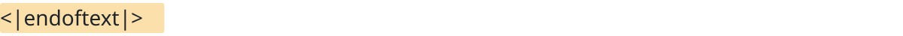

<picture>
  <source media="(max-width: 600px) and (prefers-color-scheme: dark)" srcset="assets/header-mobile-dark.svg" />
  <source media="(max-width: 600px)" srcset="assets/header-mobile-light.svg" />
  <source media="(prefers-color-scheme: dark)" srcset="assets/header-dark.svg" />
  
</picture>

I've been building for the web since 2009, when I designed and built the site for [Revista Exégesis](https://revista-exegesis.com), a collaborative magazine that is still online. In 2013 I joined Scalefast as its first front-end engineer and helped it grow from 8 people to over 300 before ESW acquired it, where I now work as an engineering manager. Along the way I've built e-commerce platforms for international brands in video games, beauty, sportswear and consumer goods.

I still write code every day, now with AI agents in the loop.

## Now

- Leading engineering teams at ESW and bringing AI agents into how we ship
- Trying new AI tools on real code and keeping what survives review

## Tools

- **Web:** `Angular` `Astro` `React` `TypeScript` `CSS` `Sass` `Storybook`
- **Backend:** `PHP` `Laravel` `Node.js` `MySQL` `WordPress`
- **Quality:** `Vitest` `Jest` `Playwright` `Cypress` `axe-core`
- **Delivery:** `Docker` `GitHub Actions` `Cloudflare Workers` `Vercel` `AWS`
- **AI:** `Claude Code` `GitHub Copilot` `Codex` `Gemini` `MCP`

## Contact

Ask me about:

- Front-end architecture at scale: modular Angular, lazy loading, microfrontends
- Accessible design systems, from tokens to components
- Setting up AI agents for a team: shared instructions, MCP servers, guardrails
- Growing a front-end team: hiring, mentoring, code review

<a href="https://cv.antoniohg.com"><picture><source media="(prefers-color-scheme: dark)" srcset="assets/contact/cv-dark.svg" /></picture></a>&nbsp;<a href="https://www.linkedin.com/in/antoniohidalgogomez/"><picture><source media="(prefers-color-scheme: dark)" srcset="assets/contact/linkedin-dark.svg" /></picture></a>&nbsp;<a href="https://bsky.app/profile/antoniohg.bsky.social"><picture><source media="(prefers-color-scheme: dark)" srcset="assets/contact/bluesky-dark.svg" /></picture></a>&nbsp;<a href="https://x.com/hgAntonio"><picture><source media="(prefers-color-scheme: dark)" srcset="assets/contact/x-dark.svg" /></picture></a>

How this profile is built

 

- The header is a sentence split into LLM tokens, drawn as SVG by a Python script, with light, dark and mobile versions switched by `<picture>` media queries.
- Each SVG embeds only the font glyphs it uses, so it looks the same everywhere.
- Animations are CSS keyframes inside the SVGs, and they stop if you prefer reduced motion.
- Every image has alt text that says what it shows; everything that matters is real text, not pictures of text.
- Before each push I preview it through GitHub's own Markdown API, so what you see here is what I saw.

<picture>
  <source media="(max-width: 600px) and (prefers-color-scheme: dark)" srcset="assets/footer-mobile-dark.svg" />
  <source media="(max-width: 600px)" srcset="assets/footer-mobile-light.svg" />
  <source media="(prefers-color-scheme: dark)" srcset="assets/footer-dark.svg" />
  
</picture>
